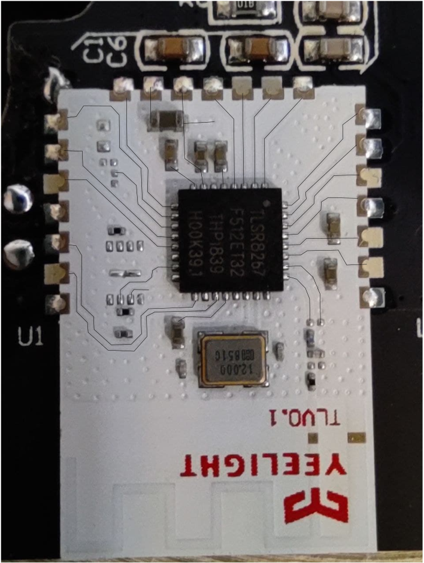
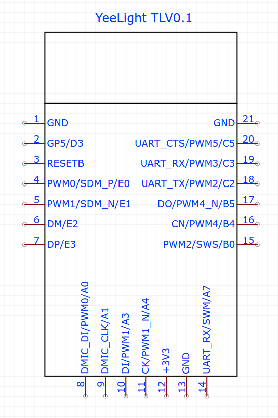

# YeeLight YLKG08YL bluetooth dimmer lamp control hardware internals

Built on the universal TLV0.1 module. Based on [TLSR8267](http://wiki.telink-semi.cn/doc/ds/DS_TLSR8267-E_Datasheet%20for%20Telink%20BLE%20SoC%20TLSR8267.pdf) SoC by TeLink semiconductor.

## TLV0.1 PCB 

