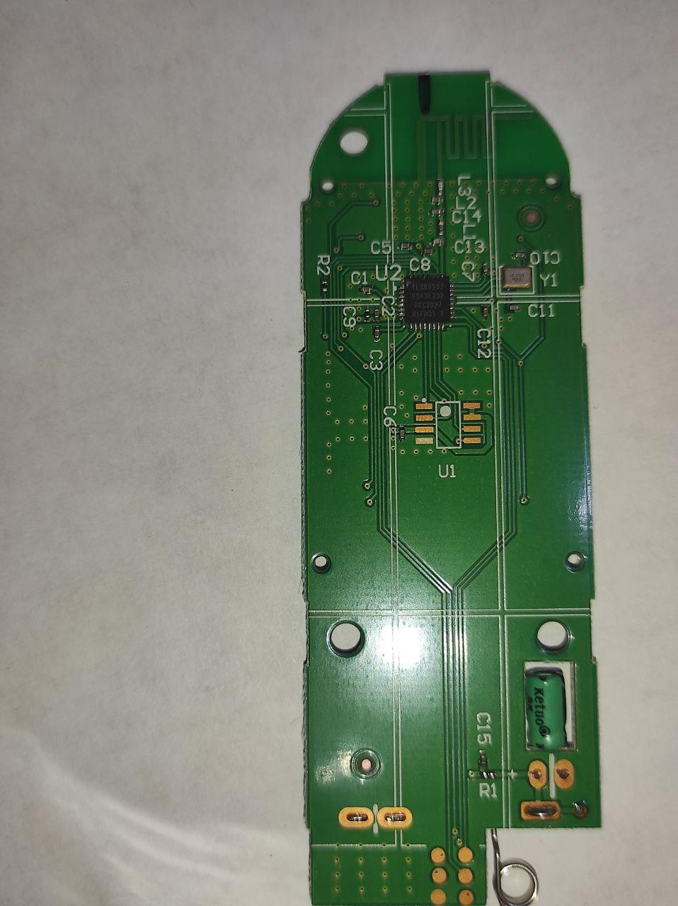
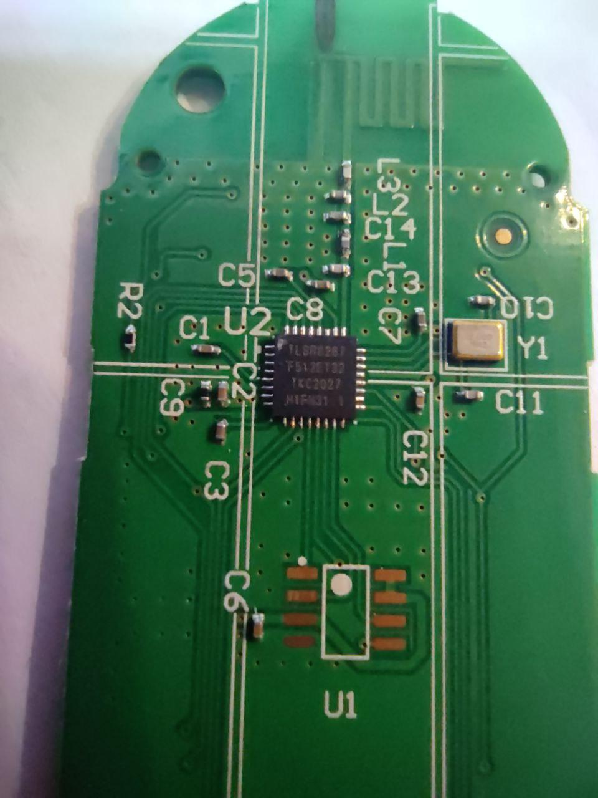
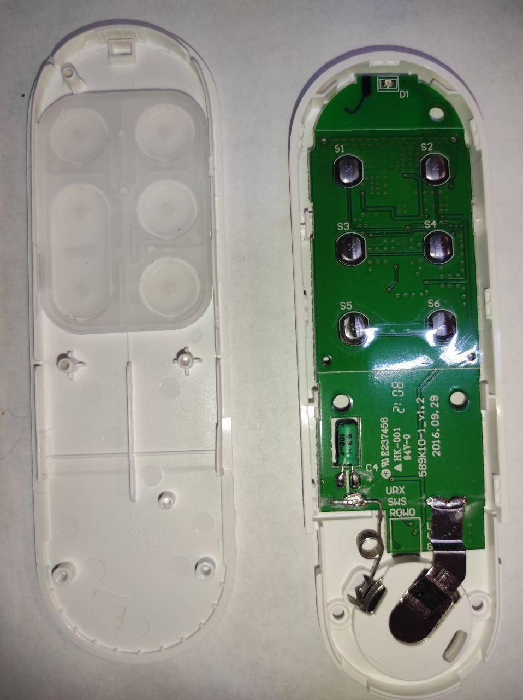
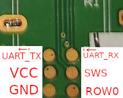

# YeeLight YLYK01YL bluetooth remote hardware internals

Built on [TLSR8267](http://wiki.telink-semi.cn/doc/ds/DS_TLSR8267-E_Datasheet%20for%20Telink%20BLE%20SoC%20TLSR8267.pdf) SoC by TeLink semiconductor.

## Board view

### Debug connector pinout:
Main board has 3.3V asynchronus UART & SWS flash/debug onewire interface routed on test pads:

## Flash image

Here is a 512K [flash firmware image](ylyk01y/ylyk01y.bin)