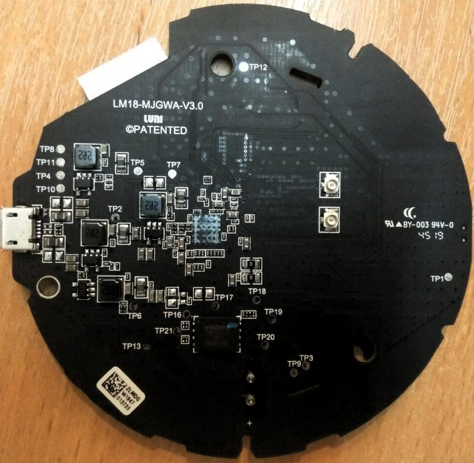
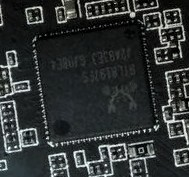
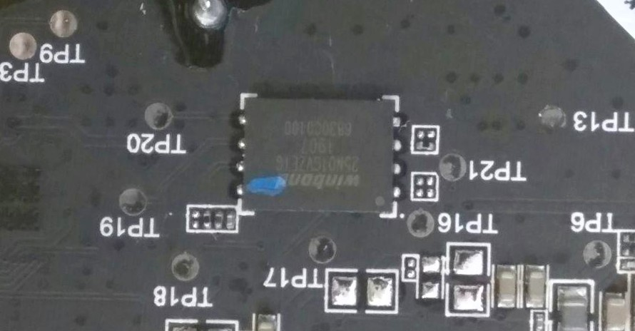
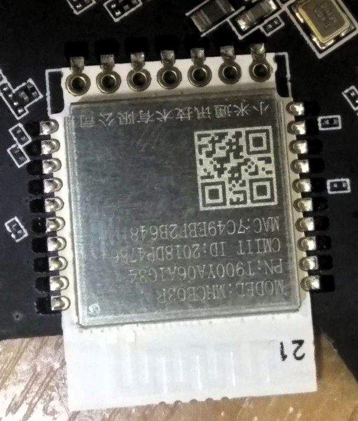
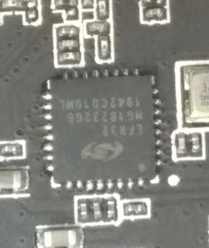

# Xiaomi Mijia Smart Multi-Mode Gateway 
##### ZNDMWG03LM LM18-MJGWA-V3.0

## Serial console
Standard TTL console at 3.3 volts, using following test pins on PCB:

| Testpoint | Signal |
| ---  | --- |
|TP8  | GND |
|TP11 | TX  |
|TP4| RX |
|TP10|+5v|

Params: 38400 8N1

Serial console input is software-disabled by boot loader.

## PCB Views

## Main CPU

RTL8197FS SoC

## Flash chip
Winbond W25M01GV 1G SPI NAND, 128MiB

| Testpoint | Signal |
| ---  | --- |
|TP13|GND|
|TP16|/CS|
|TP17|DO|
|TP18|/HOLD|
|TP19|CLK|
|TP20|DI|

|

## Bluetooth module
Model MHCB03R

## ZigBee module

EFR32 MG18232G6

 

## Logs
[Boot log](boot_log.md)

[First start / Failed IKEA lamp attach / OTA MIIO packets](packet_flow.md)